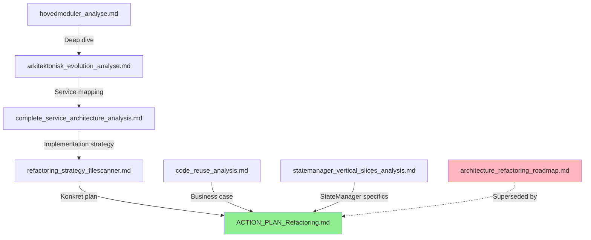

# File-Agent Documentation Status Guide
*Oversigt over aktuelle dokumenter - 22. oktober 2025*

## 📚 **Dokumentation Hierarki & Status**

### **🎯 AKTUEL HANDLINGSPLAN (PRIMARY)**

#### **📄 ACTION_PLAN_Refactoring.md** - **⭐ HOVEDDOKUMENT**
**Status:** ✅ **AKTUEL & KOMPLET**  
**Formål:** Konkret implementeringsplan til refactoring  
**Indhold:**
- Week-by-week roadmap (15 uger)
- Daily implementation checklists
- Konkrete kode eksempler
- Risk mitigation strategies
- Success criteria per fase

**→ Dette er det dokument du skal bruge når du starter!**

---

### **🔍 ANALYSEDOKUMENTER (BAGGRUND)**

#### **📄 complete_service_architecture_analysis.md** - ✅ **AKTUEL**
**Status:** Komplet service mapping  
**Formål:** Omfattende arkitektonisk analyse  
**Indhold:**
- 27 service concerns mapped på 8 domæner
- Architectural violations identificeret
- Real-world integration scenarios
- Migration priority matrix

**→ Reference for fuld forståelse af arkitekturen**

#### **📄 arkitektonisk_evolution_analyse.md** - ✅ **AKTUEL**  
**Status:** Strategisk software arkitekt analyse  
**Formål:** Problem-definition og løsningsstrategier  
**Indhold:**
- Cross-cutting concerns problemer
- StateManager god object analyse
- Domain-driven evolution strategier
- Real-time network failure flows

**→ Baggrund for hvorfor vi valgte event-driven approach**

#### **📄 code_reuse_analysis.md** - ✅ **AKTUEL**
**Status:** Genbrug potentiale analyse  
**Formål:** Kvantificering af migration effort  
**Indhold:**
- 90% code reuse dokumenteret
- 13,800 linjer kode analyseret
- Konkret migrationsplan med line counts
- ROI analysis

**→ Business case for hvorfor refactoring er lav-risiko**

---

### **🧩 KOMPONENT-SPECIFIKKE ANALYSER (REFERENCE)**

#### **📄 statemanager_vertical_slices_analysis.md** - ✅ **AKTUEL**
**Status:** StateManager refactoring strategi  
**Formål:** Vertical slices vs. tynd core beslutning  
**Indhold:**
- 715 linjer StateManager opdelt i 6 ansvar
- Vertical slices architecture anbefaling
- Migration strategy for StateManager split

**→ Specifik til StateManager refactoring (Phase 4)**

#### **📄 refactoring_strategy_filescanner.md** - ✅ **AKTUEL**  
**Status:** Scanner refactoring strategi  
**Formål:** Event Bus vs. FileScanner først beslutning  
**Indhold:**
- Dependency analyse af StateManager (13+ services)
- Risiko-evaluering af forskellige tilgange
- Definitiv anbefaling: Event Bus først

**→ Baggrund for valg af refactoring rækkefølge**

#### **📄 hovedmoduler_analyse.md** - ✅ **AKTUEL**
**Status:** Original arkitektonisk analyse  
**Formål:** Første dybe analyse af 8 hovedmoduler  
**Indhold:**
- StateManager, FileScannerService, JobQueueService etc.
- SOLID principles compliance audit
- Dataflow og coordination patterns

**→ Grundlæggende forståelse af nuværende arkitektur**

---

### **📋 LEGACY/SUPERSEDED DOKUMENTER**

#### **📄 architecture_refactoring_roadmap.md** - ⚠️ **SUPERSEDED**
**Status:** Erstattet af ACTION_PLAN_Refactoring.md  
**Formål:** Tidlig refactoring roadmap  
**Note:** Indeholder god arkitektonisk baggrund, men action plan er mere detaljeret

**→ Kan læses for baggrunds-kontext, men ACTION_PLAN er nyere og bedre**

---

## 🎯 **Anbefalet Læse-Rækkefølge**

### **For Implementation (Nu):**
1. **📄 ACTION_PLAN_Refactoring.md** - Start her! Week 1, Day 1 tasks
2. **📄 code_reuse_analysis.md** - Forstå genbrug potentiale
3. **📄 statemanager_vertical_slices_analysis.md** - Når du når Phase 4

### **For Dyb Forståelse:**
1. **📄 hovedmoduler_analyse.md** - Grundlæggende arkitektur
2. **📄 complete_service_architecture_analysis.md** - Komplet service mapping  
3. **📄 arkitektonisk_evolution_analyse.md** - Strategisk analyse
4. **📄 refactoring_strategy_filescanner.md** - Beslutnings-baggrund

### **For Reference (During Implementation):**
- **📄 ACTION_PLAN_Refactoring.md** - Daily checklist og code examples
- **📄 statemanager_vertical_slices_analysis.md** - StateManager split guide
- **📄 complete_service_architecture_analysis.md** - Service mapping reference

---

## 📚 **Dokument Sammenhæng**

---

## 🎯 **Konklusion**

### **ALLE dokumenter er aktuelle** - de bygger oven på hinanden i en logisk progression.

### **Start med:**
**📄 ACTION_PLAN_Refactoring.md** - Dette indeholder alt du skal bruge til at begynde Week 1, Day 1.

### **Reference efter behov:**
De andre dokumenter indeholder detaljeret baggrund og analyser du kan vende tilbage til under implementeringen.

### **Dokumentation hierarki:**
- **ACTION_PLAN** = Hvad skal du gøre
- **Analyse dokumenter** = Hvorfor skal du gøre det sådan
- **Komponent analyser** = Hvordan skal specifikke dele implementeres

**Bottom line: Alle dokumenter er relevante, men start med ACTION_PLAN! 📋✅**