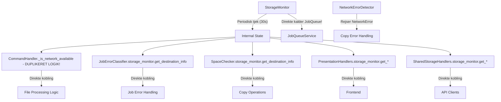
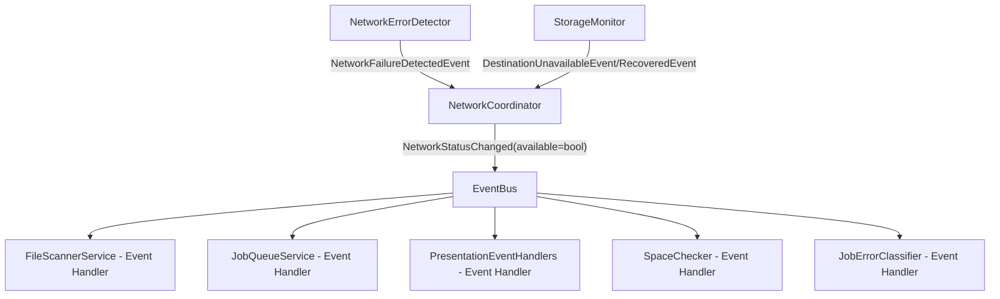

Fremtidig Refaktoriseringsplan (Version 2.0)
Status: 2. november 2025. StateManager elimineret. NetworkCoordinator FÆRDIG! ✅
Denne plan dækker de sidste 5% af arkitektonisk oprydning - primært "vertical slicing" af store komponenter.

🎯 Resterende Hovedopgaver

✅ **FÆRDIG: Implementer Netværkskoordinator** - KOMPLET! 
- NetworkCoordinator implementeret og integreret
- StorageMonitor publisher DestinationUnavailableEvent/RecoveredEvent  
- NetworkErrorDetector publisher NetworkFailureDetectedEvent
- CommandHandler bruger NetworkCoordinator.is_network_available
- JobQueueService lytter til NetworkStatusChanged events
- Cross-cutting concerns elimineret - SINGLE SOURCE OF TRUTH etableret! 🚀

"Slice" Kopi-processen (Consumer): Opløs den nye "God Handler" (command_handlers.py på 657 linjer) og den store growing_copy.py (419 linjer) til en ren, orkestreret proces.

Fuldfør CQRS-migrering: Omdan de sidste "gamle" services (directory_browsing/service.py og storage_monitor/storage_monitor.py) til CQRS-handlers for at opnå en 100% konsistent arkitektur.

## ✅ Opgave 1: Implementer Netværkskoordinator - FÆRDIG!

**Status: KOMPLET - Alle faser implementeret og fungerer! 🚀**

### ✅ IMPLEMENTERET: NetworkCoordinator Architecture
- **NetworkCoordinator** etableret som single source of truth for network status
- **Event-baseret kommunikation** mellem StorageMonitor, NetworkErrorDetector og consumers
- **Elimineret cross-cutting concerns** - ingen direkte storage_monitor dependencies for network status
- **CommandHandler** refaktoreret til at bruge NetworkCoordinator.is_network_available
- **JobQueueService** lytter til NetworkStatusChanged events for intelligent recovery
- **StorageMonitor** integration med immediate network failure response

### Opnåede Resultater:
1. **7+ kilder til netværksstatus** → **1 central kilde (NetworkCoordinator)**
2. **Direkte coupling** → **Event-baseret løs kobling**  
3. **Duplikeret logik** → **Single responsibility principle**
4. **Periodisk tjek (30s delay)** → **Øjeblikkelig network failure response**
5. **UI timing gaps** → **Synkroniseret mount/storage status**

## Problem: Kompleks netværksstatus-arkitektur (LØST!)

**Faktisk analyse afslører 7+ kilder til netværksstatus:**

1. **StorageMonitor** (Officiel kilde): Periodisk tjek hver 30s via `get_destination_info()`
2. **NetworkErrorDetector** (Reaktiv): Fejldetektion under kopieringsoperationer (rejser exceptions, INGEN events)
3. **CommandHandler._is_network_available()** (Duplikeret logik): Direkte state access til StorageMonitor
4. **JobErrorClassifier** (Indirekte): Checker `storage_monitor.get_destination_info()` for fejlklassificering
5. **SpaceChecker** (Indirekte): Checker `storage_monitor.get_destination_info()` for pladskonkrol
6. **PresentationHandlers** (UI): Direkte adgang til StorageMonitor for UI-status
7. **SharedStorageHandlers** (API): API endpoints der eksponerer storage status

**Nuværende Arkitektur (Faktisk tilstand):**


**Målet - NetworkCoordinator Arkitektur:**

## Handlingsplan - FASE-OPDELT TILGANG

### FASE 1: Grundlæggende Event Infrastructure
**Mål:** Etabler event-baseret kommunikation mellem StorageMonitor og NetworkErrorDetector

**1.1 Definer Nye Events**
Fil: `app/core/events/storage_events.py` (tilføj til eksisterende fil)

```python
@dataclass(frozen=True)
class DestinationUnavailableEvent(DomainEvent):
    """Publiceres NÅR destinationen går fra OK -> ERROR/CRITICAL."""
    reason: str
    storage_info: StorageInfo

@dataclass(frozen=True) 
class DestinationRecoveredEvent(DomainEvent):
    """Publiceres NÅR destinationen går fra ERROR/CRITICAL -> OK."""
    reason: str
    storage_info: StorageInfo

@dataclass(frozen=True)
class NetworkFailureDetectedEvent(DomainEvent):
    """Publiceres når NetworkErrorDetector finder en netværksfejl under kopiering."""
    error_message: str
    file_id: str
    operation: str
```

**1.2 Refaktorér NetworkErrorDetector til at publicere events**
Fil: `app/domains/file_processing/copy/network_error_detector.py`
- Tilføj `event_bus: DomainEventBus` til `__init__`
- Modificer `check_write_error()` til at publicere `NetworkFailureDetectedEvent` før den rejser `NetworkError`

### FASE 2: Opret NetworkCoordinator
**Mål:** Central koordinator for alle netværksstatus-beslutninger

**2.1 Opret NetworkCoordinator**
Fil: `app/domains/network_mount/network_coordinator.py`

```python
class NetworkCoordinator:
    """
    Central koordinator for netværksstatus. 
    Lytter efter NetworkFailureDetectedEvent og Storage events.
    Publicerer autoritativ NetworkStatusChanged event.
    """
### Arkitektur Transformation - Før vs Efter:

**Før (7+ kilder til netværksstatus):**
- CommandHandler._is_network_available() (duplikeret logik)
- StorageMonitor direkta dependency injections overalt
- JobQueueService.storage_monitor.get_destination_info()
- NetworkErrorDetector rejser exceptions (ingen events)

**Efter (1 central kilde):**
- NetworkCoordinator som single source of truth
- Event-baseret kommunikation: NetworkStatusChanged
- StorageMonitor publisher DestinationUnavailableEvent/RecoveredEvent
- NetworkErrorDetector publisher NetworkFailureDetectedEvent
- CommandHandler/JobQueueService subscriber til NetworkStatusChanged

**Resultat: Løs kobling, ingen cross-cutting concerns, real-time network status! 🚀**

---

### FASE 5: Refaktorér CommandHandler
**Mål:** Fjern duplikeret `_is_network_available` logik

**5.1 Slet duplikeret network checking**
Fil: `app/domains/file_processing/command_handlers.py`
- Slet `_is_network_available()` metoden
- Fjern network checking fra `handle_file_ready`

**5.2 Tilføj network event handling**  
- Lyt efter `NetworkStatusChanged` events
- Sæt filer til `WAITING_FOR_NETWORK` når netværk bliver utilgængeligt

### FASE 6: Refaktorér Resterende Dependencies
**Mål:** Fjern direkte storage_monitor access fra alle andre steder

**6.1 SpaceChecker**
- Lyt efter `NetworkStatusChanged` i stedet for direkte `storage_monitor.get_destination_info()`

**6.2 JobErrorClassifier** 
- Lyt efter network events i stedet for direkte storage access

**6.3 PresentationHandlers**
- Behold direkte access til storage_monitor for UI (eller overvej caching via NetworkCoordinator)

**6.4 SharedStorageHandlers**
- Behold direkte access til storage_monitor for API responses

### FASE 7: Validering og Test
**Mål:** Sikr at ny arkitektur virker korrekt

**7.1 Integration test**
- Test at NetworkCoordinator reagerer på både øjeblikkelige og periodiske fejl
- Test at alle subscribers reagerer korrekt på NetworkStatusChanged

**7.2 Performance test**
- Verificer at event-baseret tilgang ikke introducerer latency
- Test failover og recovery scenarier

Opgave 2: "Slice" Kopi-processen (Consumer)
Problem: Du har rullet ændringer til growing_copy.py tilbage. Din file_processing/command_handlers.py er nu 657 linjer, hvilket indikerer, at du har skabt en ny "God Handler", sandsynligvis en ProcessJobCommandHandler, der gør alt det arbejde, som de små consumer-services burde gøre.

Løsning: Gå tilbage til "Composition"-modellen, som JobProcessor oprindeligt brugte. En "slice" er en proces, ikke én fil.

Handlingsplan (for AI-agent)
Slet "God Handleren":

Fil: app/domains/file_processing/command_handlers.py

Handling: Slet den store ProcessJobCommandHandler (som sandsynligvis indeholder logikken fra JobProcessor.process_job).

Fil: app/domains/file_processing/commands.py

Handling: Slet ProcessJobCommand.

Gendan JobProcessor som Orkestrator:

Fil: app/domains/file_processing/consumer/job_processor.py

Verificer: Sikr dig, at denne klasse er en "tynd orkestrator" som i hovedmoduler_analyse.md. Den skal ikke have nogen CQRS-roller. Dens process_job-metode er den "use case slice".

Verificer: Sikr dig, at JobProcessor's __init__ modtager alle sine hjælpere via DI (JobSpaceManager, JobFinalizationService, JobFilePreparationService, JobCopyExecutor).

Refaktorér FileCopierService (Worker):

Fil: app/domains/file_processing/copy/file_copier_service.py

Handling: Denne klasse er din worker. Den skal ikke kalde CommandBus.

Opdater __init__: Fjern CommandBus-afhængigheden. Tilføj job_processor: JobProcessor og job_queue: JobQueueService.

Opdater worker-loop (_run_worker):

Fjern: await self.command_bus.execute(ProcessJobCommand(job=job))

Tilføj: Den klassiske worker-loop:

Python

job = await self.job_queue.get_next_job()
if job:
    process_result = await self.job_processor.process_job(job)
    if process_result.success:
        await self.job_queue.mark_job_completed(job, process_result.processing_time)
    else:
        await self.job_queue.mark_job_failed(job, process_result.error_message, process_result.processing_time)
Refaktorér growing_copy.py (Den Tilbage-rullede Opgave):

Fil: app/domains/file_processing/copy/growing_copy.py (419 linjer).

Mål: Denne fil skal kun indeholde orkestreringslogikken. Den har allerede (korrekt) uddelegeret I/O til CopyIoLoop og verificering til FileVerificationService.

Problem: Den har stadig _is_file_currently_growing og _growing_copy_loop (den store orkestrerings-loop).

Handling: Opret en ny, "tyndere" orkestreringsklasse (f.eks. CopyOrchestrator) og flyt den komplekse _growing_copy_loop og copy_file logik dertil. Lad GrowingFileCopyStrategy blive en "dum" dataklasse eller en meget tynd facade.

Handling: Flyt _is_file_currently_growing til JobFilePreparationService, da det er dér, beslutningen om GROWING_COPY vs. COPYING tages.

Opgave 3: Fuldfør CQRS-migrering (Resterende Domæner)
Refaktorér directory_browsing:

Problem: service.py er 395 linjer.

Handling: Flyt logikken fra service.py over i de eksisterende (og tomme?) handlers.py (til Querys som GetDirectoryListingQuery).

Refaktorér storage:

Problem: storage_monitor.py er 396 linjer.

Handling: Opret commands.py, queries.py og handlers.py i app/domains/storage/.

Commands: Opret TriggerStorageCheckCommand. Flyt logikken fra trigger_immediate_check til en ny TriggerStorageCheckCommandHandler.

Queries: Opret GetStorageInfoQuery og GetOverallStorageStatusQuery. Flyt logikken fra get_source_info, get_destination_info, get_overall_status til nye QueryHandler-klasser.

Oprydning: StorageMonitorService er nu kun en baggrunds-worker, der kører _monitoring_loop.