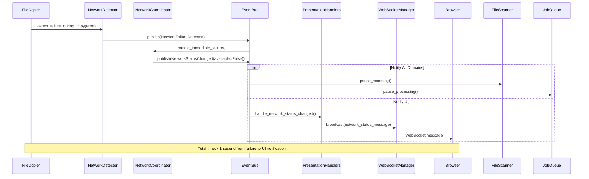
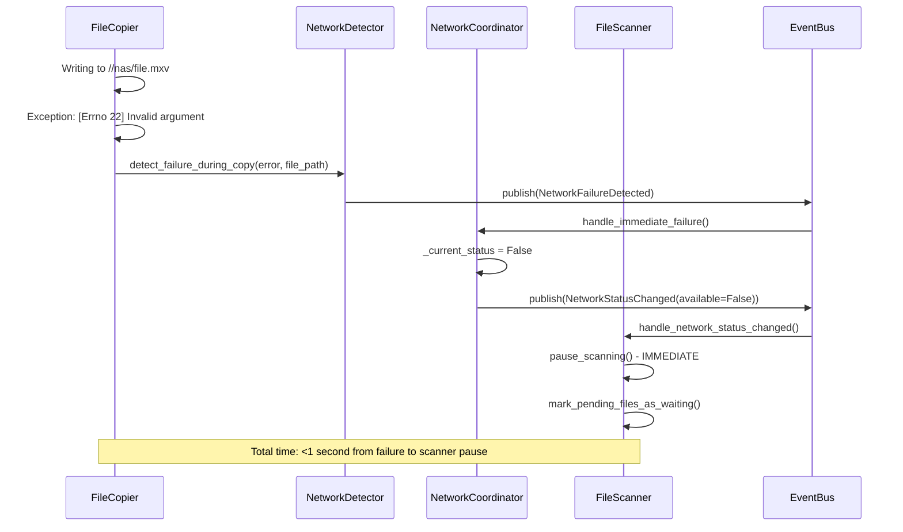

# Arkitektonisk Evolution - Fra Spaghetti til Maintainable Code

*Software Arkitekt Analyse - 22. oktober 2025*

## 🚨 Problemanalyse: Hvor SOLID bliver til Spaghetti

Efter dyb analyse af kodebasen er hovedproblemerne:

### 1. **Cross-Cutting Concerns Overalt**
**Network Error Handling** er spredt over:
- `StorageMonitorService` - detekterer destination unavailable
- `FileScannerService` - tjekker storage status før scanning
- `GrowingFileDetector` - har `WAITING_FOR_NETWORK` logic
- `JobQueueService` - netværkstjek før queueing  
- `Copy Strategies` - `NetworkErrorDetector` i hver strategi
- `JobErrorClassifier` - klassificerer network errors

**Result:** Når netværk går ned, skal 6+ forskellige services koordinere - recipe for bugs.

### 2. **StateManager som God Object**
```python
# StateManager gør ALT:
- File tracking (600+ files)
- Retry scheduling & execution  
- Pub/sub event system
- Cooldown management
- Growth state tracking
- Network status reasoning
- Cleanup policies
```
**600+ linjer** - direkte brud på size mandate.

### 3. **Implicit Dependencies Overalt**
```python
# Eksempel fra GrowingFileDetector
if tracked_file.status == FileStatus.WAITING_FOR_NETWORK:
    # Logic spredt flere steder - hvem ejer denne decision?
```

### 4. **Service Koordinering Nightmare**
For at forstå én simpel operation skal man holde 8+ services i hovedet samtidigt.

---

## 🌐 **Presentation Layer Integration i Domain Architecture**

### **Problem: WebSocket og API krydsreferencer**
Den nuværende `WebSocketManager` har direkte dependencies til:
- `StateManager` - for file status updates
- `StorageMonitorService` - for storage status 
- `Specific serialization logic` - spredt rundt i manager

**Result:** Presentation layer er tæt koblet til business logic

### **Løsning: Event-Driven Presentation Layer**

#### **1. Centralized Event-to-WebSocket Mapping**
```python
# app/domains/presentation/event_handlers.py
class PresentationEventHandlers:
    """Maps domain events to WebSocket messages"""
    
    def __init__(self, websocket_manager: WebSocketManager):
        self.websocket_manager = websocket_manager
        
    async def handle_file_status_changed(self, event: FileStatusChanged):
        """Convert domain event to WebSocket message"""
        message = {
            "type": "file_update",
            "data": {
                "file_path": event.file_path,
                "old_status": event.old_status.value if event.old_status else None,
                "new_status": event.new_status.value,
                "file": self._serialize_tracked_file(event.tracked_file),
                "timestamp": event.timestamp.isoformat(),
            }
        }
        await self.websocket_manager.broadcast(message)
        
    async def handle_network_status_changed(self, event: NetworkStatusChanged):
        """Broadcast network status to UI immediately"""
        message = {
            "type": "network_status",
            "data": {
                "network_available": event.network_available,
                "source": event.source,
                "timestamp": event.timestamp.isoformat(),
                "message": f"Network {'recovered' if event.network_available else 'unavailable'}"
            }
        }
        await self.websocket_manager.broadcast(message)
        
    async def handle_storage_status_changed(self, event: StorageStatusChanged):
        """Map storage events to WebSocket"""
        message = {
            "type": "storage_update", 
            "data": {
                "storage_type": event.storage_type,
                "old_status": event.old_status.value if event.old_status else None,
                "new_status": event.new_status.value,
                "storage_info": self._serialize_storage_info(event.storage_info),
                "timestamp": event.timestamp.isoformat(),
            }
        }
        await self.websocket_manager.broadcast(message)
```

#### **2. Simplified WebSocket Manager**
```python
# app/domains/presentation/websocket_manager.py  
class WebSocketManager:
    """Pure WebSocket connection management - no domain logic"""
    
    def __init__(self):
        self._connections: List[WebSocket] = []
        # NO direct domain dependencies!
        
    async def connect(self, websocket: WebSocket) -> None:
        await websocket.accept()
        self._connections.append(websocket)
        
        # Initial state is provided by API endpoint, not manager
        logging.info(f"WebSocket connected. Total: {len(self._connections)}")
        
    async def broadcast(self, message: Dict[str, Any]) -> None:
        """Generic broadcast - no domain-specific logic"""
        if not self._connections:
            return
            
        message_json = json.dumps(message)
        disconnected = []
        
        for websocket in self._connections:
            try:
                await websocket.send_text(message_json)
            except (WebSocketDisconnect, Exception) as e:
                disconnected.append(websocket)
                
        for websocket in disconnected:
            self.disconnect(websocket)
            
    def disconnect(self, websocket: WebSocket) -> None:
        if websocket in self._connections:
            self._connections.remove(websocket)
```

#### **3. Domain-Agnostic API Endpoints**
```python
# app/domains/presentation/api_endpoints.py
class PresentationAPI:
    """Domain-agnostic API that queries through event bus"""
    
    def __init__(self, query_bus: QueryBus):
        self.query_bus = query_bus
        
    async def get_initial_state(self) -> Dict[str, Any]:
        """Get initial state for new WebSocket connections"""
        
        # Query all domains through event bus
        files = await self.query_bus.execute(GetAllFilesQuery())
        stats = await self.query_bus.execute(GetStatisticsQuery()) 
        storage = await self.query_bus.execute(GetStorageStatusQuery())
        network = await self.query_bus.execute(GetNetworkStatusQuery())
        
        return {
            "files": [self._serialize_file(f) for f in files],
            "statistics": stats,
            "storage": storage,
            "network": network,
            "timestamp": datetime.now().isoformat()
        }
        
    async def get_storage_info(self, storage_type: str) -> StorageInfo:
        """Get storage info through query bus"""
        query = GetStorageInfoQuery(storage_type=storage_type)
        return await self.query_bus.execute(query)
```

#### **4. Event Bus Integration**
```python
# app/main.py - Startup integration
async def setup_presentation_layer(event_bus: EventBus, websocket_manager: WebSocketManager):
    """Wire up presentation layer to domain events"""
    
    handlers = PresentationEventHandlers(websocket_manager)
    
    # Subscribe to all relevant domain events
    event_bus.subscribe(FileStatusChanged, handlers.handle_file_status_changed)
    event_bus.subscribe(NetworkStatusChanged, handlers.handle_network_status_changed) 
    event_bus.subscribe(StorageStatusChanged, handlers.handle_storage_status_changed)
    event_bus.subscribe(MountStatusChanged, handlers.handle_mount_status_changed)
    
    logging.info("Presentation layer subscribed to domain events")
```

---

## 🔄 **Real-Time Network Failure Flow med Presentation Layer**

### **Updated Flow: Network failure → UI notification**



### **Benefits:**
- ✅ **Decoupled presentation** - WebSocket manager doesn't know about domains
- ✅ **Real-time UI updates** - Network failures shown immediately in browser
- ✅ **Consistent API** - All data access through query bus
- ✅ **Easy testing** - Mock event handlers independently
- ✅ **Single source of truth** - Events drive both business logic AND UI

---

## 📡 **Eksisterende API Integration**

### **Nuværende API Endpoints Migration:**

#### **Storage API → Network Management Domain**
```python
# Current: app/api/storage.py - directly depends on StorageMonitorService
# New: app/domains/network_management/api.py

class NetworkManagementAPI:
    def __init__(self, query_bus: QueryBus, command_bus: CommandBus):
        self.query_bus = query_bus
        self.command_bus = command_bus
        
    async def get_source_storage(self) -> StorageInfo:
        """Query pattern instead of direct service dependency"""
        return await self.query_bus.execute(GetStorageInfoQuery(storage_type="source"))
        
    async def get_destination_storage(self) -> StorageInfo:
        return await self.query_bus.execute(GetStorageInfoQuery(storage_type="destination"))
        
    async def trigger_storage_check(self) -> Dict[str, Any]:
        """Command pattern for actions"""
        await self.command_bus.execute(TriggerStorageCheckCommand())
        return {"success": True, "message": "Storage check triggered"}
```

#### **Configuration API → Shared Infrastructure**
```python
# Current: app/routers/api.py - system-level configuration
# New: app/domains/shared/infrastructure/api.py

class InfrastructureAPI:
    """System-level operations that span domains"""
    
    async def get_settings(self) -> Settings:
        return await self.query_bus.execute(GetSettingsQuery())
        
    async def reload_config(self) -> Dict[str, Any]:
        """Command that affects all domains"""
        await self.command_bus.execute(ReloadConfigurationCommand())
        return {"success": True, "message": "Configuration reloaded"}
        
    async def get_log_files(self) -> List[LogFileInfo]:
        return await self.query_bus.execute(GetLogFilesQuery())
```

#### **WebSocket API → Presentation Domain**
```python
# Current: app/api/websockets.py - simple WebSocket endpoint  
# New: app/domains/presentation/websocket_api.py

@router.websocket("/api/ws/live")
async def websocket_endpoint(
    websocket: WebSocket, 
    presentation_api: PresentationAPI = Depends(get_presentation_api)
):
    websocket_manager = await presentation_api.connect_websocket(websocket)
    
    try:
        # Send initial state through presentation API
        initial_state = await presentation_api.get_initial_state()
        await websocket.send_text(json.dumps({
            "type": "initial_state",
            "data": initial_state
        }))
        
        # Handle ping/pong
        while True:
            message = await websocket.receive_text()
            if message == "ping":
                await websocket.send_text("pong")
                
    except WebSocketDisconnect:
        await presentation_api.disconnect_websocket(websocket)
```

---

## 🎯 **Updated Migration Strategy med Presentation Layer**

### **Week 1-2: Foundation + Presentation Refactor**
```python
# 1. Create domain structure INCLUDING presentation
mkdir app/domains/{file_discovery,file_processing,network_management,presentation,shared}

# 2. Extract WebSocketManager logic
# Move business logic OUT of WebSocketManager into event handlers
# WebSocketManager becomes pure connection management

# 3. Create PresentationEventHandlers
# Map domain events to WebSocket messages

# 4. Update API endpoints to use query pattern
# Remove direct service dependencies
```

### **Week 3-4: Event Bus + StateManager Split**
```python
# 1. Implement EventBus
# 2. Create Query/Command buses (simple CQRS)
# 3. Split StateManager into FileRegistry + RetryManager + EventPublisher
# 4. Update API endpoints to use buses instead of direct calls
```

### **Week 5-6: Network Coordination + Real-time UI**
```python
# 1. Implement NetworkCoordinator with multiple detection sources
# 2. Wire up NetworkFailureDetector to copy strategies  
# 3. Add network status events to PresentationEventHandlers
# 4. Test real-time network failure → UI notification flow
```

### **Week 7-8: Integration Testing + Performance**
```python
# 1. End-to-end testing: File discovery → Copy → UI updates
# 2. Network failure scenarios with UI verification
# 3. WebSocket performance testing with multiple clients
# 4. API response time optimization through caching
```

---

### **Problem: Network failure discovery chain**
```
1. StorageMonitor checks every 30 seconds (periodic)
2. Meanwhile FileCopier discovers network failure immediately (during copy)
3. FileScanner continues adding files to queue (unaware)
4. Result: Queue floods with files that can't be processed
```

### **Solution: Event-Driven Network State Propagation**

#### **Immediate Network Failure Detection:**
```python
# app/domains/file_processing/network_detector.py
class NetworkFailureDetector:
    """Real-time network failure detection during copy operations"""
    
    def __init__(self, event_bus: EventBus):
        self.event_bus = event_bus
        
    async def detect_failure_during_copy(self, error: Exception, file_path: str):
        """Called by copy strategies when network errors occur"""
        if self._is_network_error(error):
            # IMMEDIATE propagation - don't wait for next StorageMonitor cycle
            await self.event_bus.publish(NetworkFailureDetected(
                detected_by="file_copy_operation",
                file_path=file_path,
                error_details=str(error),
                timestamp=datetime.now()
            ))
            
    def _is_network_error(self, error: Exception) -> bool:
        # Check for errno.ENOTCONN, EHOSTUNREACH, etc.
        network_indicators = [
            "Network is unreachable", 
            "No route to host",
            "Connection refused",
            "[Errno 22]"  # Invalid argument (Windows network error)
        ]
        return any(indicator in str(error) for indicator in network_indicators)
```

#### **Event-Driven State Propagation:**
```python
# Domain Events
@dataclass
class NetworkFailureDetected(Event):
    detected_by: str        # "file_copy_operation" or "storage_monitor" 
    file_path: str         # File being copied when failure occurred
    error_details: str
    timestamp: datetime

@dataclass
class NetworkStatusChanged(Event):
    network_available: bool
    source: str            # Who triggered the change
    timestamp: datetime

# app/domains/network_management/coordinator.py
class NetworkCoordinator:
    """Central authority for network state - handles multiple detection sources"""
    
    def __init__(self, event_bus: EventBus):
        self.event_bus = event_bus
        self._current_status = True
        self._last_failure_time = None
        
        # Subscribe to both detection sources
        event_bus.subscribe(NetworkFailureDetected, self.handle_immediate_failure)
        event_bus.subscribe(StorageMonitorCheck, self.handle_periodic_check)
        
    async def handle_immediate_failure(self, event: NetworkFailureDetected):
        """Handle real-time failure detection from copy operations"""
        if self._current_status:  # Only if we thought network was up
            logging.error(f"🚨 IMMEDIATE NETWORK FAILURE: {event.detected_by} - {event.error_details}")
            
            self._current_status = False
            self._last_failure_time = event.timestamp
            
            # Propagate immediately to all domains
            await self.event_bus.publish(NetworkStatusChanged(
                network_available=False,
                source=f"immediate_detection_{event.detected_by}",
                timestamp=event.timestamp
            ))
            
    async def handle_periodic_check(self, event: StorageMonitorCheck):
        """Handle periodic storage monitor results"""
        if event.network_available != self._current_status:
            self._current_status = event.network_available
            
            await self.event_bus.publish(NetworkStatusChanged(
                network_available=event.network_available,
                source="periodic_storage_monitor",
                timestamp=event.timestamp
            ))
```

#### **FileScanner Response:**
```python
# app/domains/file_discovery/handlers.py
class FileDiscoveryNetworkHandler:
    
    async def handle_network_status_changed(self, event: NetworkStatusChanged):
        if not event.network_available:
            logging.warning(f"🛑 PAUSING FILE DISCOVERY: Network down ({event.source})")
            
            # Immediate response - don't wait for next scan cycle
            await self.scanner.pause_scanning()
            await self.scanner.mark_pending_files_as_waiting()
            
        else:
            logging.info(f"✅ RESUMING FILE DISCOVERY: Network recovered ({event.source})")
            await self.scanner.resume_scanning()
            await self.scanner.requeue_waiting_files()
```

#### **FileCopier Integration:**
```python
# app/domains/file_processing/strategies.py
class NormalFileCopyStrategy:
    
    def __init__(self, network_detector: NetworkFailureDetector):
        self.network_detector = network_detector
        
    async def copy_file(self, source: str, destination: str, tracked_file: TrackedFile):
        try:
            # Normal copy operation
            await self._perform_copy(source, destination)
            
        except Exception as e:
            # IMMEDIATE network failure detection
            await self.network_detector.detect_failure_during_copy(e, source)
            
            # Let the error bubble up for normal error handling
            raise
```

---

## 🔄 **Real-Time Network Failure Flow**

### **Scenario: NAS goes down during active copy**



### **Benefits over current approach:**
- ✅ **Sub-second response time** instead of waiting for next StorageMonitor cycle (30s)
- ✅ **Multiple detection sources** - both real-time and periodic
- ✅ **No queue flooding** - FileScanner stops immediately 
- ✅ **Clear responsibility** - NetworkCoordinator owns the decision
- ✅ **Audit trail** - Events show exactly what happened when

---

## 💡 **Implementation Details: Network Failure Coordination**

### **Step 1: Extract Network Detection from Copy Strategies**
```python
# Current problem: Network detection scattered across multiple copy strategies
# Solution: Centralize detection logic

# app/domains/file_processing/network_detector.py
class NetworkFailureDetector:
    NETWORK_ERROR_PATTERNS = [
        "Network is unreachable",
        "No route to host", 
        "Connection refused",
        "[Errno 22]",  # Windows network error
        "[Errno 53]",  # Software caused connection abort
        "[Errno 67]",  # No route to host
    ]
    
    def __init__(self, event_bus: EventBus):
        self.event_bus = event_bus
        
    async def wrap_copy_operation(self, copy_func, source: str, dest: str):
        """Wrapper that detects network failures during any copy operation"""
        try:
            result = await copy_func(source, dest)
            return result
            
        except Exception as e:
            # Check if this is a network failure
            if self._is_network_error(e):
                await self._handle_network_failure(e, source)
            
            # Always re-raise - let normal error handling continue
            raise
            
    def _is_network_error(self, error: Exception) -> bool:
        error_str = str(error).lower()
        return any(pattern.lower() in error_str for pattern in self.NETWORK_ERROR_PATTERNS)
        
    async def _handle_network_failure(self, error: Exception, file_path: str):
        """Immediate network failure notification"""
        await self.event_bus.publish(NetworkFailureDetected(
            detected_by="file_copy_operation",
            file_path=file_path,
            error_details=str(error),
            timestamp=datetime.now()
        ))
        
        logging.error(f"🚨 NETWORK FAILURE DETECTED during copy: {file_path} - {error}")
```

### **Step 2: Integrate with all Copy Strategies**
```python
# app/domains/file_processing/strategies.py
class NormalFileCopyStrategy:
    def __init__(self, network_detector: NetworkFailureDetector):
        self.network_detector = network_detector
        
    async def copy_file(self, source: str, dest: str, tracked_file: TrackedFile):
        # Wrap copy operation for automatic network detection
        return await self.network_detector.wrap_copy_operation(
            self._internal_copy, source, dest
        )
        
    async def _internal_copy(self, source: str, dest: str):
        # Original copy logic without network detection concerns
        with open(source, 'rb') as src, open(dest, 'wb') as dst:
            shutil.copyfileobj(src, dst)

class GrowingFileCopyStrategy:
    def __init__(self, network_detector: NetworkFailureDetector):
        self.network_detector = network_detector
        
    async def copy_file(self, source: str, dest: str, tracked_file: TrackedFile):
        # Same pattern - network detection is handled transparently
        return await self.network_detector.wrap_copy_operation(
            self._internal_growing_copy, source, dest
        )
```

### **Step 3: FileScanner Network-Aware Pausing**
```python
# app/domains/file_discovery/scanner.py
class FileScanner:
    def __init__(self, event_bus: EventBus):
        self.event_bus = event_bus
        self._scanning_paused = False
        self._pending_files = []
        
        # Subscribe to network status changes
        event_bus.subscribe(NetworkStatusChanged, self._handle_network_change)
        
    async def _handle_network_change(self, event: NetworkStatusChanged):
        if not event.network_available:
            await self._pause_operations()
        else:
            await self._resume_operations()
            
    async def _pause_operations(self):
        """Immediate pause of all scanning operations"""
        self._scanning_paused = True
        
        # Mark any files currently being processed as waiting
        discovered_files = await self.state_manager.get_files_by_status(FileStatus.DISCOVERED)
        ready_files = await self.state_manager.get_files_by_status(FileStatus.READY)
        
        for file in discovered_files + ready_files:
            await self.state_manager.update_file_status_by_id(
                file.id, 
                FileStatus.WAITING_FOR_NETWORK,
                error_message="Network unavailable - waiting for recovery"
            )
            
        logging.warning(f"📂 FILE SCANNING PAUSED: {len(discovered_files + ready_files)} files marked as waiting")
        
    async def _resume_operations(self):
        """Resume scanning and reprocess waiting files"""
        self._scanning_paused = False
        
        # Requeue files that were waiting for network
        waiting_files = await self.state_manager.get_files_by_status(FileStatus.WAITING_FOR_NETWORK)
        
        for file in waiting_files:
            await self.state_manager.update_file_status_by_id(
                file.id,
                FileStatus.READY,  # Back to ready for processing
                error_message=None
            )
            
        logging.info(f"📂 FILE SCANNING RESUMED: {len(waiting_files)} files requeued")
        
    async def discover_files(self):
        """Normal file discovery - now network-aware"""
        if self._scanning_paused:
            logging.debug("📂 Skipping file discovery - network unavailable")
            return
            
        # Normal discovery logic
        await self._scan_source_directory()
```

### **Step 4: Coordination Timeline**
```python
# Typical failure scenario timeline:

# T+0ms:    FileCopier encounters network error during write
# T+5ms:    NetworkDetector identifies it as network failure  
# T+10ms:   NetworkFailureDetected event published
# T+15ms:   NetworkCoordinator receives event, updates state
# T+20ms:   NetworkStatusChanged(available=False) published
# T+25ms:   FileScanner receives event, pauses scanning
# T+30ms:   Active files marked as WAITING_FOR_NETWORK
# T+35ms:   System is now in "network down" state

# Compare with current approach:
# T+0ms:    FileCopier encounters network error
# T+0ms:    File marked as FAILED
# T+30000ms: StorageMonitor discovers network is down (next cycle)
# T+30005ms: FileScanner might pause (if it checks network status)
# 
# Result: 30 seconds of continued scanning and queue flooding
```

---

### **Løsning 1: Modular Monolith med Domain Slices**
*Best fit for dette projekt*

#### Core Princip: Organiser efter Business Capability, ikke Technical Layer

```
📁 app/domains/
├── file_discovery/      # Alt om filopdagelse
│   ├── __init__.py
│   ├── scanner.py      # File scanning logic
│   ├── stability.py    # File stability detection  
│   ├── growth.py       # Growing file detection
│   └── events.py       # FileDiscovered, FileStable events
│
├── file_processing/     # Alt om kopiering
│   ├── __init__.py
│   ├── processor.py    # Job processing orchestrator
│   ├── strategies.py   # Copy strategies
│   ├── progress.py     # Progress tracking
│   ├── network_detector.py  # Real-time network failure detection
│   └── events.py       # FileCopyStarted, FileCompleted, NetworkFailure events
│
├── network_management/  # Alt om netværk og storage
│   ├── __init__.py
│   ├── monitor.py      # Network monitoring
│   ├── recovery.py     # Recovery coordination
│   ├── detector.py     # Network error detection
│   └── events.py       # NetworkDown, NetworkUp events
│
├── presentation/        # API og UI lag (NYT)
│   ├── __init__.py
│   ├── websocket_manager.py  # Real-time WebSocket broadcasting
│   ├── api_endpoints.py      # REST API endpoints  
│   ├── event_handlers.py     # Domain event → WebSocket mappers
│   └── serializers.py        # Data transformation for UI
│
└── shared/
    ├── events/         # Domain events system
    ├── state/          # Simplified state management
    └── messaging/      # Simple message bus
```

**Fordele:**
- ✅ Hver domain er self-contained
- ✅ Cross-cutting concerns samlet ét sted
- ✅ Easy testing - test entire domain in isolation
- ✅ Python-friendly - ikke over-engineered

---

### **Løsning 2: Event-Driven Architecture med Simple Message Bus**

#### Centralized Event Coordination uden kompleks CQRS

```python
# Simple Event Bus - ikke Redux/MediatR complexity
class EventBus:
    def __init__(self):
        self._handlers: Dict[Type[Event], List[Callable]] = {}
    
    def subscribe(self, event_type: Type[Event], handler: Callable):
        self._handlers.setdefault(event_type, []).append(handler)
    
    async def publish(self, event: Event):
        handlers = self._handlers.get(type(event), [])
        await asyncio.gather(*[h(event) for h in handlers])

# Domain Events
@dataclass
class NetworkStatusChanged(Event):
    network_available: bool
    timestamp: datetime

@dataclass  
class FileDiscovered(Event):
    file_path: str
    file_size: int
    discovered_at: datetime
```

**Koordinering gennem Events:**
```python
# Network går ned
await event_bus.publish(NetworkStatusChanged(network_available=False))

# Alle interesserede domæner reagerer automatisk:
# - FileDiscovery: Stop scanning new files
# - FileProcessing: Pause active jobs  
# - UI: Show network error state
```

**Fordele:**
- ✅ Loose coupling mellem domains
- ✅ Easy to add new behavior without changing existing code
- ✅ Built-in audit trail (event log)
- ✅ Simple Python implementation

---

### **Løsning 3: Simplified CQRS med Read/Write Separation**

#### Kun hvor det giver mening - ikke overalt

```python
# Write Side: Commands for mutations
@dataclass
class DiscoverFile(Command):
    file_path: str
    file_size: int

@dataclass
class StartFileCopy(Command):
    file_id: str
    destination_path: str

# Read Side: Queries for data retrieval  
@dataclass
class GetFilesAwaitingCopy(Query):
    pass

@dataclass
class GetNetworkStatus(Query):
    pass

# Simple Command/Query Bus
class CommandBus:
    async def execute(self, command: Command) -> CommandResult:
        handler = self._get_handler(command)
        return await handler.handle(command)

class QueryBus:
    async def execute(self, query: Query) -> QueryResult:
        handler = self._get_handler(query)
        return await handler.handle(query)
```

**Fordele:**
- ✅ Clear separation af read vs write operations
- ✅ Easier testing - mock command/query handlers
- ✅ Natural fit for async Python
- ✅ Prevents accidental data mutations in reads

---

## 🎯 **Anbefalet Løsning: Hybrid Approach**

### **Phase 1: Domain Slices + Simple Event Bus**

**Step 1:** Restructure til domain-orienteret layout
```bash
# Migration kommando
mkdir -p app/domains/{file_discovery,file_processing,network_management}
# Move related services til deres domains
```

**Step 2:** Implementer simple EventBus
```python
# app/shared/events/bus.py
class EventBus:
    """Simple async event bus for domain coordination"""
    # Implementation som vist ovenfor
```

**Step 3:** Refactor StateManager
```python
# app/domains/shared/state/file_registry.py  
class FileRegistry:
    """Pure file tracking - single responsibility"""
    
# app/domains/shared/state/retry_manager.py
class RetryManager:
    """Retry scheduling and execution"""
    
# app/domains/shared/events/publisher.py
class EventPublisher:
    """Pub/sub notifications"""
```

### **Phase 2: Network Error Coordination**

**Centralized Network Authority:**
```python
# app/domains/network_management/coordinator.py
class NetworkCoordinator:
    """Single source of truth for network status"""
    
    def __init__(self, event_bus: EventBus):
        self.event_bus = event_bus
        
    async def handle_network_down(self):
        # Centralized logic for network failures
        await self.event_bus.publish(NetworkStatusChanged(False))
        
    async def handle_network_recovery(self):
        # Centralized recovery coordination
        await self.event_bus.publish(NetworkStatusChanged(True))
```

**Domain Event Handlers:**
```python
# app/domains/file_discovery/handlers.py
class FileDiscoveryNetworkHandler:
    async def handle_network_status_changed(self, event: NetworkStatusChanged):
        if not event.network_available:
            # Pause file discovery
            await self.scanner.pause_scanning()
        else:
            # Resume discovery
            await self.scanner.resume_scanning()

# app/domains/file_processing/handlers.py  
class FileProcessingNetworkHandler:
    async def handle_network_status_changed(self, event: NetworkStatusChanged):
        if not event.network_available:
            # Mark active copies as WAITING_FOR_NETWORK
            await self.processor.pause_active_copies()
        else:
            # Resume processing
            await self.processor.resume_processing()
```

---

## 🔄 **Migration Strategy - Stepwise Evolution**

### **Week 1-2: Foundation**
```python
# 1. Create domain structure
mkdir app/domains/{file_discovery,file_processing,network_management,shared}

# 2. Implement EventBus
# Simple 50-line implementation

# 3. Move services to domains
# Start with least coupled services
```

### **Week 3-4: StateManager Refactoring**
```python
# 1. Extract FileRegistry from StateManager
# 2. Extract RetryManager  
# 3. Extract EventPublisher
# 4. Update all references
```

### **Week 5-6: Network Coordination**
```python
# 1. Create NetworkCoordinator
# 2. Move all network logic to network_management domain
# 3. Replace direct calls with event-driven coordination
# 4. Remove network logic from other domains
```

### **Week 7-8: Testing & Cleanup**
```python
# 1. Add comprehensive domain tests
# 2. Integration tests for event flows
# 3. Remove old service dependencies  
# 4. Performance testing
```

---

## 🚀 **Alternative Patterns - When to Use What**

### **Mediator Pattern** 
```python
# Kun hvis du har complex service-to-service communication
# I dette projekt: EventBus er simplere og mere maintainable
```

**Dont use hvis:** Under 10 services, simple workflows  
**Use hvis:** 15+ services, complex coordination needs

### **Saga Pattern**
```python
# For complex multi-step business processes
# I dette projekt: File copy workflow kunne benefit
```

**Example:**
```python
class FileCopySaga:
    """Orchestrates complete file copy workflow"""
    async def execute(self, file_copy_command):
        try:
            await self.check_space()
            await self.prepare_destination()  
            await self.copy_file()
            await self.verify_copy()
            await self.cleanup_source()
        except Exception as e:
            await self.compensate(e)  # Rollback logic
```

### **Repository Pattern**
```python
# Kun hvis du skifter til database persistence
# Nuværende in-memory state gør det unødvendigt
```

---

## 📊 **Sammenligning af Tilgange**

| Approach | Complexity | Maintainability | Python-fit | Implementation Effort |
|----------|------------|-----------------|------------|---------------------|
| **Current (Service Layers)** | 🔴 High | 🟡 Medium | 🟡 OK | - |
| **Vertical Slices** | 🟢 Low | 🟢 High | 🟢 Excellent | 🟢 Low |
| **Modular Monolith** | 🟡 Medium | 🟢 High | 🟢 Good | 🟡 Medium |
| **Full CQRS** | 🔴 High | 🟡 Medium | 🔴 Over-engineered | 🔴 High |
| **Event Sourcing** | 🔴 Very High | 🔴 Complex | 🔴 Java-esque | 🔴 Very High |

---

## 🎯 **Konkret Action Plan**

### **Uge 1: NetworkContext + Retry Extraction**
```python
# 1. Create app/core/network_context.py
# 2. Create app/core/retry_manager.py  
# 3. Refactor StateManager (remove retry logic)
# 4. Update all network checks
```

### **Uge 2-3: Feature Reorganization**
```python
# 1. Create app/features/ structure
# 2. Extract FileLifecycleManager
# 3. Consolidate transfer logic
# 4. Update dependency injection
```

### **Uge 4: Event Bus Implementation**
```python
# 1. Implement simple event bus
# 2. Define domain events
# 3. Replace direct calls with events
# 4. Add event logging/monitoring
```

---

## 🏆 **Forventede Resultater**

### **Efter Phase 1:**
- ✅ Network logic centralized (1 place to change)
- ✅ StateManager under 250 lines
- ✅ Easier debugging of network issues

### **Efter Phase 2:**
- ✅ Use cases contained in single features
- ✅ Reduced cognitive load (understand 1 feature at a time)
- ✅ Clearer module boundaries

### **Efter Phase 3:**
- ✅ Loose coupling via events
- ✅ Easy to add new features
- ✅ Testable in isolation
- ✅ Still feels like Python (not Java Enterprise)

---

## 🚨 **Anti-Patterns at Undgå**

### **Over-Engineering**
```python
# ❌ Don't do this (Java-esque)
class IFileDiscoveryServiceFactoryProvider(ABC)

# ✅ Do this (Pythonic)
class FileDiscovery:
    async def discover_files(self) -> List[File]
```

### **Too Many Abstractions**
```python
# ❌ Don't do this
class AbstractBaseRepositoryInterface(ABC)
class IUnitOfWorkPattern(ABC)

# ✅ Do this  
class FileStore:
    async def save(self, file: File) -> None
```

### **Configuration Hell**
```python
# ❌ Don't do this
@inject("IFileService", "IStorageService", "INetworkService")

# ✅ Do this
class FileManager:
    def __init__(self, network: NetworkContext):
```

---

---

## 📊 **Complexity Analysis: Before vs After**

### **Before (Current)**
```
Understanding File Copy Flow:
1. Read StateManager (600 lines)
2. Understand 8 service interactions  
3. Follow 6 different network error paths
4. Debug across 12+ files
5. Mental model: "How do all these services coordinate?"

Cognitive Load: 🧠🧠🧠🧠🧠 (5/5 - Very High)
```

### **After (Domain Slices + Events)**
```
Understanding File Copy Flow:
1. Look in file_processing domain (150 lines total)
2. Check incoming events (3 event types)  
3. Single network error path in network_management
4. Debug within domain boundaries
5. Mental model: "What events trigger what actions?"

Cognitive Load: 🧠🧠 (2/5 - Low-Medium)
```

---

## ⚡ **Python-Specific Best Practices**

### **1. Leverage Python's Strengths**
```python
# Use dataclasses for events (not heavy OOP)
@dataclass(frozen=True)
class FileDiscovered:
    file_path: str
    file_size: int
    discovered_at: datetime = field(default_factory=datetime.now)

# Use async/await naturally (not callback hell)
async def handle_file_discovered(event: FileDiscovered):
    await process_file(event.file_path)
```

### **2. Simple Dependency Injection**
```python
# Don't over-engineer DI - Python has modules
# app/domains/file_discovery/__init__.py
def create_file_scanner(config: Config) -> FileScanner:
    return FileScanner(config)

# Usage
from app.domains.file_discovery import create_file_scanner
scanner = create_file_scanner(config)
```

### **3. Type Hints for Clarity**
```python
# Clear domain boundaries through types
from app.domains.network_management.types import NetworkStatus
from app.domains.file_discovery.types import FileMetadata

class FileProcessor:
    def __init__(self, network_status: NetworkStatus):
        self.network_status = network_status
```

---

## 🎯 **Implementation Priority Matrix**

| Change | Impact | Effort | Priority |
|--------|--------|--------|----------|
| Domain Restructure | High | Medium | 🟢 Do First |
| EventBus | High | Low | 🟢 Do First |  
| StateManager Split | High | High | 🟡 Do Second |
| Network Coordination | Medium | Medium | 🟡 Do Second |
| CQRS Commands | Low | Medium | 🔴 Do Later |
| Saga Pattern | Low | High | 🔴 Do Later |

---

## 📈 **Success Metrics**

### **Code Quality Metrics**
- ✅ All classes < 250 lines
- ✅ Max 3 dependencies per service  
- ✅ Network logic in 1 domain only
- ✅ 90%+ test coverage per domain

### **Developer Experience Metrics**  
- ✅ New feature implementation time < 50% current
- ✅ Bug fix time < 30% current
- ✅ Onboarding time for new developers < 2 days
- ✅ "I understand this codebase" confidence rating > 8/10

### **Operational Metrics**
- ✅ Network recovery time < 5 seconds
- ✅ Zero state inconsistencies during failures
- ✅ Memory usage growth < 10% due to events
- ✅ Startup time unchanged

---

*Denne evolution bevarer systemets robusthed mens det gør koden maintainable og forståelig. Det er ikke en Big Bang rewrite - det er controlled technical debt reduction gennem incrementelle forbedringer.*