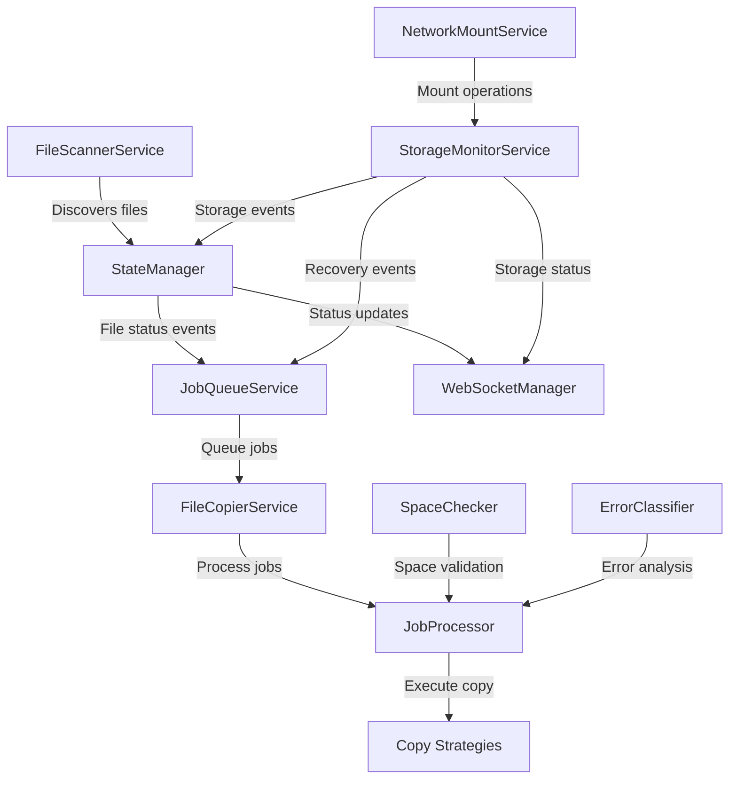

# File Transfer Agent - Hovedmoduler og Arkitektonisk Analyse

*Dato: 22. oktober 2025*

## Oversigt

Baseret på dyb analyse af kodebasen kan jeg identificere **8 hovedmoduler** med klare ansvarsområder og indbyrdes forbindelser. Applikationen følger en **Producer-Consumer-Monitor** arkitektur med stærk separation of concerns.

## Hovedmoduler

### 1. **StateManager** - Centraliseret Tilstandsstyring
**Lokation:** `app/services/state_manager.py`  
**Ansvar:** Single source of truth for alle filer

#### Hovedfunktioner:
- Holder styr på alle `TrackedFile` objekter med deres status og metadata
- Publisher/Subscriber pattern til at notificere andre services om ændringer
- Thread-safe operationer med `asyncio.Lock`
- Håndterer retry-logik og cooldown-perioder
- Cleanup af gamle og manglende filer
- File stability tracking og metadata updates

#### 🚨 **Arkitektonisk Problem:**
- **Størrelse:** 600+ linjer - **BRUD PÅ SIZE MANDATE**
- **Refaktorering nødvendig:** Bør opdeles i:
  - `FileRegistry` - fil tracking og lookup
  - `RetryManager` - retry scheduling og execution
  - `EventPublisher` - pub/sub notifications

---

### 2. **FileScannerService** - Filopdagelse (Producer)
**Lokation:** `app/services/scanner/file_scanner_service.py`  
**Ansvar:** Scanner source-mappen kontinuerligt

#### Hovedfunktioner:
- Opdager nye filer og registrerer dem i StateManager
- Bestemmer om filer er "stabile" eller "growing"
- Integreret med StorageMonitorService for netværksstatus
- Kører som background asyncio task
- Cleanup af manglende filer

#### Arkitektur:
- Delegerer til en separat `FileScanner` orchestrator
- **Størrelse:** ~50 linjer wrapper - **FØLGER SIZE MANDATE** ✅

---

### 3. **JobQueueService** - Opgave-koordinering (Buffer)
**Lokation:** `app/services/job_queue.py`  
**Ansvar:** Kobler producer og consumer sammen

#### Hovedfunktioner:
- Lytter til StateManager events via pub/sub
- Tilføjer klar filer til `asyncio.Queue`
- Netværksstatus-tjek før queueing
- Håndterer destination recovery og network recovery
- Universal recovery system for alle fejlede filer

#### Integration:
- Subscriber til StateManager
- Konsulterer StorageMonitorService for network status
- **Størrelse:** ~230 linjer - **FØLGER SIZE MANDATE** ✅

---

### 4. **FileCopierService** - Koordinering af Workers (Consumer)
**Lokation:** `app/services/file_copier.py`  
**Ansvar:** Administrerer worker pool til kopiering

#### Hovedfunktioner:
- Starter/stopper asyncio worker tasks
- Delegerer faktisk jobprocessering til JobProcessor
- Worker pool management (max concurrent copies)
- Statistik og monitoring

#### Design:
- **Størrelse:** ~100 linjer - **FØLGER SIZE MANDATE** ✅
- Enkelt ansvar: kun worker management

---

### 5. **JobProcessor** - Kopieringslogik Orchestrator
**Lokation:** `app/services/consumer/job_processor.py`  
**Ansvar:** Håndterer komplet workflow for enkeltstående kopieringsjob

#### Hovedfunktioner:
- Pre-flight space checks via SpaceChecker
- File preparation og destination path generation
- Delegerer til JobCopyExecutor for faktisk kopiering
- Fejlhåndtering og finalization via specialized services

#### Specialized Services Integration:
- `JobSpaceManager` - space checking og retry logic
- `JobFinalizationService` - completion workflows
- `JobFilePreparationService` - file og path preparation
- `JobCopyExecutor` - copy execution med error handling
- `OutputFolderTemplateEngine` - dynamic path generation

#### Design:
- **Størrelse:** ~100 linjer - **FØLGER SIZE MANDATE** ✅
- Pure orchestrator pattern

---

### 6. **StorageMonitorService** - Netværk og Disk Overvågning
**Lokation:** `app/services/storage_monitor/storage_monitor.py`  
**Ansvar:** Central storage authority for hele systemet

#### Hovedfunktioner:
- Overvåger source og destination tilgængelighed og diskplads
- Automatisk netværksmount-håndtering via NetworkMountService
- Real-time WebSocket notifications til UI
- Trigger universal recovery når destination bliver tilgængelig igen
- Detekterer destination unavailable/recovery scenarios

#### SRP-Compliant Arkitektur:
- `StorageState` - state management og caching
- `DirectoryManager` - directory operations og lifecycle
- `NotificationHandler` - WebSocket notifications
- `MountStatusBroadcaster` - mount operation status

#### Design:
- **Størrelse:** ~200 linjer - **FØLGER SIZE MANDATE** ✅
- Hver komponent < 150 linjer

---

### 7. **WebSocketManager** - Real-time UI Communication
**Lokation:** `app/services/websocket_manager.py`  
**Ansvar:** Live opdateringer til web frontend

#### Hovedfunktioner:
- Subscriber til StateManager events
- Broadcast file status ændringer via WebSocket
- Storage status notifications fra StorageMonitorService
- Mount operation status updates
- Client connection management

#### Integration:
- Subscriber til StateManager pub/sub
- Modtager storage events fra StorageMonitorService
- **Størrelse:** ~150 linjer - **FØLGER SIZE MANDATE** ✅

---

### 8. **Copy Strategy System** - Kopieringsstrategier
**Lokation:** `app/services/copy/` og `app/services/copy_strategies.py`  
**Ansvar:** Fleksibel kopierings-implementation

#### Komponenter:
- `CopyStrategyFactory` - vælger korrekt strategi baseret på file type
- `NormalFileCopyStrategy` - standard kopiering med verification
- `GrowingFileCopyStrategy` - kopiering under skrivning (chunked)
- `ResumableNormalFileCopyStrategy` - genoptagelse efter fejl
- `JobCopyExecutor` - orchestrator for copy execution med error handling

#### Design Pattern:
- Strategy Pattern for fleksibilitet
- **Hver strategi:** ~100-150 linjer - **FØLGER SIZE MANDATE** ✅

---

## Arkitektoniske Forbindelser



## Dataflow og Koordinering

### Normal Operation Flow:
1. **FileScannerService** opdager nye filer → **StateManager** (DISCOVERED)
2. File stability check → **StateManager** update (READY)
3. **StateManager** notificerer → **JobQueueService** 
4. Network check → Add to **asyncio.Queue**
5. **FileCopierService** workers → **JobProcessor**
6. **JobProcessor** → **Copy Strategies** → completion
7. **WebSocketManager** broadcaster alle ændringer til UI

### Error Recovery Flow:
1. **StorageMonitorService** detekterer destination unavailable
2. Trigger pause via **JobQueueService**
3. Files marked as WAITING_FOR_NETWORK
4. **StorageMonitorService** detekterer recovery
5. Universal recovery via **JobQueueService**
6. Reset WAITING_FOR_NETWORK files to READY

### Space Management Flow:
1. **JobProcessor** → **SpaceChecker** pre-flight check
2. Insufficient space → **SpaceRetryManager**
3. Schedule retry → **StateManager** (WAITING_FOR_SPACE)
4. Automatic retry efter delay → reset to READY

---

## SOLID Principles Compliance

### ✅ **Single Responsibility Principle**
- Hver service har ét klart ansvar
- StorageMonitorService opdelt i specialized komponenter
- JobProcessor delegerer til specialized services

### ✅ **Open/Closed Principle**
- Copy strategies kan udvides uden at ændre eksisterende kode
- Strategy Pattern tillader nye copy methods

### ✅ **Liskov Substitution Principle**
- Copy strategies er udskiftelige
- Storage checkers kan erstattes

### ✅ **Interface Segregation Principle**
- Services afhænger kun af de interfaces de bruger
- Dependency injection via abstractions

### ✅ **Dependency Inversion Principle**
- Core logic afhænger ikke af FastAPI/WebSocket implementation
- Dependencies injected via `dependencies.py`
- Interfaces defined via Python Protocols

---

## Dependency Management

### Singleton Pattern:
Alle services administreres som singletons via `app/dependencies.py`:

```python
# Central dependency injection
def get_state_manager() -> StateManager
def get_file_scanner() -> FileScannerService  
def get_job_queue_service() -> JobQueueService
def get_file_copier() -> FileCopierService
def get_storage_monitor() -> StorageMonitorService
def get_websocket_manager() -> WebSocketManager
```

### Circular Dependency Handling:
- Late injection for WebSocketManager ↔ StorageMonitorService
- JobQueueService gets StorageMonitor reference after initialization

---

## Kritiske Arkitektoniske Issues

### 🚨 **Size Mandate Violations**

#### StateManager (600+ linjer)
**Problem:** Monolithic class violating <250 line mandate
**Solution:** Refactor into:
- `FileRegistry` - file tracking, lookup, og current file logic
- `RetryManager` - retry scheduling, cancellation, og execution
- `EventPublisher` - pub/sub notifications og subscriber management

### ⚠️ **Potential Issues**

#### JobProcessor Complexity
- Koordinerer mange specialized services
- Risk for growing beyond size mandate
- Consider extraction af workflow orchestration

#### StorageMonitorService Dependencies
- Multiple injected dependencies
- Complex initialization order
- Consider dependency reduction

---

## Performance Considerations

### Async/Await Architecture:
- Alle background tasks bruger `asyncio`
- Non-blocking operations throughout
- Concurrent file copying med worker pool

### Memory Management:
- StateManager cleanup af gamle filer
- Retry task cleanup ved completion
- WebSocket connection management

### Error Handling:
- Graceful degradation ved network issues
- Automatic retry mechanisms
- Universal recovery system

---

## Testing Strategy

### Unit Testing:
- Hver service har dedicated test suite
- Mock dependencies via dependency injection
- Isolated testing af business logic

### Integration Testing:
- Service-to-service communication
- End-to-end workflow testing
- Error scenario validation

### Test Coverage Areas:
- File stability detection
- Copy strategy selection
- Error classification og retry logic
- Storage monitoring og recovery
- WebSocket notifications

---

## Future Refactoring Roadmap

### Immediate (Size Mandate Compliance):
1. **StateManager refactoring** til 3 separate klasser
2. Review JobProcessor for potential extraction
3. Audit all classes for size compliance

### Medium Term (Architecture Enhancement):
1. Extract workflow orchestration from JobProcessor
2. Implement formal interfaces via Python Protocols
3. Add configuration validation layer

### Long Term (Scalability):
1. Consider message queue for job distribution
2. Database persistence for state management
3. Metrics og monitoring integration

---

*Denne analyse demonstrerer en veldefineret arkitektur med stærk separation of concerns, men med specifikke areas der kræver refactoring for fuld SOLID compliance.*